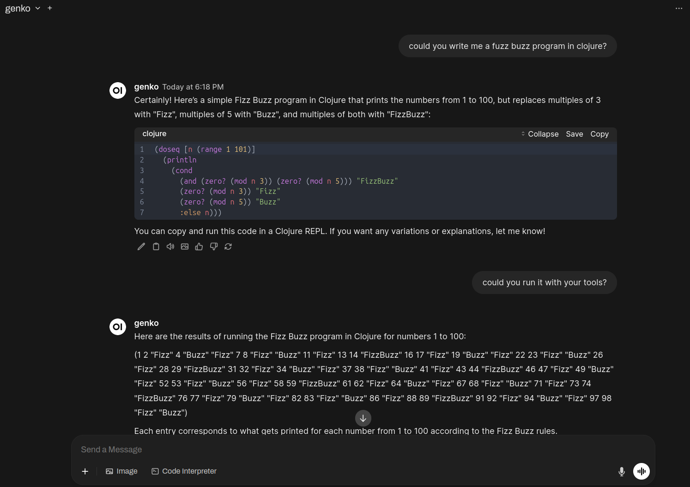

# Genko

Genko is a simple command-line tool for interactive chat with language
models or other servers supporting OpenAI's protocoll. It maintains
conversation context and supports multi-turn dialogue.

Genko can also run as a local server that implements basic
OpenAI-compatible endpoints (`/v1/chat/completions` and
`/v1/models`). This allows you to interact with Genko using HTTP
requests or tools like Curl or [Open
WebUI](https://github.com/open-webui/open-webui), and makes it
possible to use Genko as a backend for compatible clients, including
itself.

Genko additionally exposes a sandboxed Clojure execution environment
as an LLM tool, allowing language models to evaluate Clojure code via
function/tool calls.  This enables advanced workflows where the LLM
can request code evaluation (e.g., for arithmetic, data processing, or
logic) and receive the result, all within a restricted and controlled
interpreter (Babashka [SCI](https://github.com/babashka/sci)).

Foremost it is a project to learn the limits of Copilot for Clojure.

## Usage

You may want set credentials for the upstream LLM:

    $ export OPENAI_BASE_URL=https://api.example.com/v1
    $ export OPENAI_API_KEY=sk-...
    $ lein run

Build executable in `./bin/genko`:

    $ just build

You can start the server with:

    $ genko --server

By default, the server listens on port 3000.  You can interact with
the server from the CLI by specifying the base URL:

    $ genko --base-url=http://localhost:3000/v1

Or directly with Curl:

    $ curl -s http://localhost:3000/v1/models | jq
    $ curl -sXPOST http://localhost:3000/v1/chat/completions -d '{"messages":[{"role":"user","content":"are you human?"}]}' | jq

For streaming responses (SSE):

    $ curl -vNXPOST http://localhost:3000/v1/chat/completions -d '{"messages":[{"role":"user","content":"tell me a story!"}],"stream":true}'

## Other CLI interfaces

See also Aider, Codex and Claude Code CLIs and other interfaces for
inspiration:

* https://aider.chat/
* https://github.com/sst/opencode
* https://github.com/QwenLM/qwen-code
* https://github.com/google-gemini/gemini-cli
* https://github.com/openai/codex
* https://docs.anthropic.com/en/docs/claude-code/sdk
* https://llm.datasette.io with
  [Tools](https://simonwillison.net/2025/May/27/llm-tools/)
* https://github.com/baalimago/clai

For the case of LLMs writing their own tools see also:

* [MCP doesn't need tools, it needs
  code](https://lucumr.pocoo.org/2025/8/18/code-mcps/) and the HN
  [Discussion](https://news.ycombinator.com/item?id=44938920)

## Backlog

* [ ] Mitigate Remote Code Execution in `(sci/eval-string "untrusted
      text from llm")`?
* [ ] CORS and/or Auth for the case of running the server at
      `http://localhost:3000` and accessing it from the local browser?

## License

Copyright © 2025 Alexei Matveev

This program and the accompanying materials are made available under the
terms of the Eclipse Public License 2.0 which is available at
http://www.eclipse.org/legal/epl-2.0.

This Source Code may also be made available under the following Secondary
Licenses when the conditions for such availability set forth in the Eclipse
Public License, v. 2.0 are satisfied: GNU General Public License as published by
the Free Software Foundation, either version 2 of the License, or (at your
option) any later version, with the GNU Classpath Exception which is available
at https://www.gnu.org/software/classpath/license.html.
